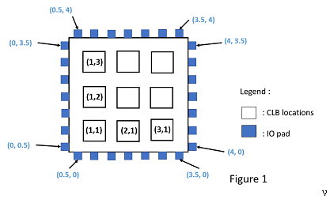
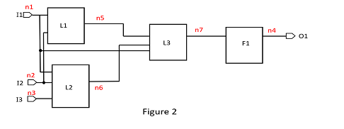
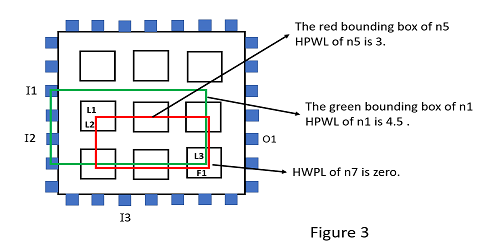

# FPGA project
## Introduction
In this project, you are asked to write a C/C++ program to solve the placement problem for LUT-based FPGA after technology mapping. The goal is to place all instances (i.e., LUTs and 1-bit flip-flops) of a netlist onto CLB locations of a target FPGA with all PI/POs (i.e., primary inputs and primary outputs) already pre-placed so that the total wirelength is minimized. The wirelength of each net is estimated by its HPWL.



## Input(benchmarks)
### Info file
CLB_Dim 3 3
Num_I/O_Pad 7 7
Num_PI 3 (input count)
I1 0 2.5  w(m+1, m-1), h(n+1, n-1)
I2 0 1.5
I3 1.5 0
Num_PO 1
O1 4 1.5 tag, w(m+1, m-1), h(n+1, n-1)
Num_Inst 3 1 (L count, F count)
L1
L2
L3
F1

### Nets file

7
n1 I1 L1 L2 L3
n2 I2 L1 L2
n3 I3 L3
n4 F1 O1
n5 L1 L3
n6 L2 L3
n7 L3 F1

## Ouput:


L1 1 2 
L2 1 2
L3 3 1
F1 3 1  


## Usage
### #Installation
If you don't have C++ please download.

---

#### #Clone
Clone the project.
```bash=
$ git clone https://github.com/Daviswww/FPGA-HPWL.git
$ cd FPGA-HPWL
```

---

#### #Makefile(compile)
Run Makefile in `src` folder.
If you finish executing Makefile, you will see the main file in the `bin` folder.

```bash=
$ make
```
Makefile path:`FPGA-HPWL/final_project/src`
Compile output path:`FPGA-HPWL/final_project/bin`

#### #Running(execute)
Put the input file into `benchmarks` folder, and run command(in bin folder).
The output result will be in the `outputs` folder.
 
```bash=
$ ./main <file name>
```

example:
```bash=
$ ./main alu4_4
```
Execute `main` path:`FPGA-HPWL/final_project/bin`
Input path:`FPGA-HPWL/final_project/benchmarks`
Output path:`FPGA-HPWL/final_project/outputs`

#### #Limit
input: inst[10000]
clb_array[500][500]
